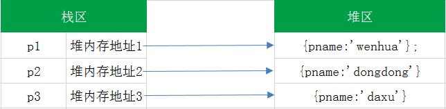
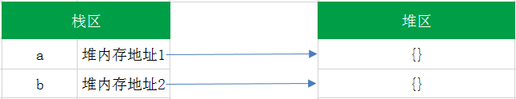
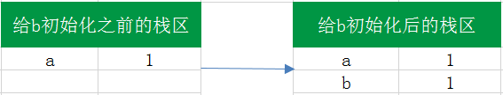
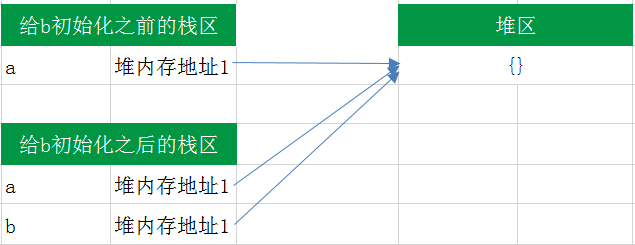
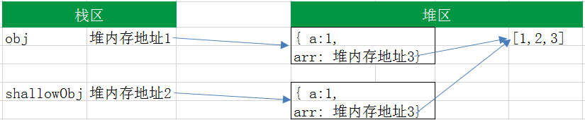

# JS 浅拷贝 VS 深拷贝

## 栈与堆

- 栈和堆都是内存中划分出来的用来存储的空间

> 栈（stack）是由系统自动分配的内存空间，它由系统自动释放；而堆（heap）则是动态分配的内存，大小不定也不会自动释放。

## JS数据类型

- JS中的数据类型,主要分为基本数据类型和引用类型.

### 基本数据类型

- 基本数据类型主要有:undefined,null,string,number,boolean

#### 基本数据类型存放在栈中

- 基本类型的值在内存中占据固定大小的空间，被保存在栈内存中.它们是按值存放的，所以可以直接访问。

#### 基本数据类型的值不可变

> javascript中的原始值（undefined、null、布尔值、数字和字符串）与对象（包括数组和函数）有着根本区别。原始值是不可更改的：任何方法都无法更改（或“突变”）一个原始值。对数字和布尔值来说显然如此 —— 改变数字的值本身就说不通，而对字符串来说就不那么明显了，因为字符串看起来像由字符组成的数组，我们期望可以通过指定索引来假改字符串中的字符。实际上，javascript 是禁止这样做的。字符串中所有的方法看上去返回了一个修改后的字符串，实际上返回的是一个新的字符串值。

- 基本数据类型的值是不可变的，动态修改了基本数据类型的值，它的原始值也是不会改变的，例如：

``````````````
    var str = "abc";
    console.log(str[1]="s");    // s
    console.log(str);           // abc
``````````````

- 通常情况下,我们都是对一个变量重新赋值，而不是改变基本数据类型的值。在 js 中没有方法是可以改变布尔值和数字的。虽然有很多操作字符串的方法，但是这些方法都是返回一个新的字符串，并没有改变其原有的数据。

- 所以,基本数据类型值不可变

#### 基本数据类型的比较是值的比较

- 基本类型的比较是值的比较，只要它们的值相等就认为他们是相等的，例如：

`````````````
    var a = 1;
    var b = 1;
    console.log(a === b);//true
`````````````

- 在比较是最好使用绝对===,因为==会进行隐式的类型转换,例如:

``````````````
    var a = 1;
    var b = true;
    console.log(a == b);//true
``````````````

- 在进行隐式转换时,会消耗掉一部分额外的性能,同时也会出现一些意想不到的错误.

### 引用类型

#### 引用数据类型存放在堆中

- 引用类型的值是对象，保存在堆内存中，保存引用类型值的变量实际上保存的并不是对象本身，而是一个指向该对象的指针。堆中的每个空间大小不一样，要根据情况进行特定的分配，例如:

```````````
    var p1 = {pname:'wenhua'};
    var p2 = {pname:'dongdong'};
    var p3 = {pname:'daxu'};
```````````


#### 引用类型值可变

- 引用类型的值是可以改变的,例如:

````````````````
    var a = [1,2,3];
    a[1] = 5;
    console.log(a);//[1,5,3]
````````````````

#### 引用类型的比较是引用的比较
- js不允许直接访问内存中的位置，也就是不能直接访问操作对象的内存空间。在操作对象时，实际上是在操作对象的引用而不是实际的对象。在对两个引用类型进行比较时,是看其引用的指针是否指向同一个对象,例如:
``````````
    var a={};
    var b={};
    console.log(a==b);//false 
``````````
- 尽管变量a和变量b都表示一个空对象,但是其在内存中位置不一样,变量a和变量b所指向的并不是同一块区域,它们引用的指针是不同的,也就是说a,b不相等.


## 传值与传址
- 在我们进行赋值操作的时候，基本数据类型的赋值（=）是在内存中新开辟一段栈内存，然后再把再将值赋值到新的栈中。例如：
````````````````
    var a = 1;
    var b = a;
    a ++ ;
    console.log(a); // 2
    console.log(b); // 1
````````````````

- 所以说，基本类型的赋值的两个变量是两个独立相互不影响的变量。

- 但是引用类型的赋值是传址。从一个变量向另一个变量赋值引用类型的值，赋值的其实是指针，两个变量最终都指向同一个对象，因此两者之间操作互相有影响。例如：
`````````````
    var a = {}; // a保存了一个空对象的实例
    var b = a;  // a和b都指向了这个空对象

    a.name = 'dongdong';
    console.log(a.name); // 'dongdong'
    console.log(b.name); // 'dongdong'

    b.age = 18;
    console.log(b.age);// 18
    console.log(a.age);// 18

    console.log(a == b);// true
`````````````


## 浅拷贝 vs 深拷贝

- 基本类型拷贝的时候只是在内存中又开辟了新的空间,它与被拷贝的元素互不相干,因此深拷贝和浅拷贝只针对像 Object, Array 这样的复杂对象。简单来说，浅拷贝只拷贝一层对象的属性，而深拷贝则递归拷贝了所有层级。也有说法是赋值为浅拷贝,递归拷贝所有层级为深拷贝,本文认为浅拷贝为拷贝一层对象的属性.

### 浅拷贝

- 一个简单的浅拷贝实现,如下:
```````````
    var obj = { a:1, arr: [1,2,3] };
    var shallowObj = shallowCopy(obj);

    function shallowCopy(obj) {
        var newObj = {};
        for (var prop in obj) {
            if (obj.hasOwnProperty(prop)) {
            newObj[prop] = obj[prop];
            }
        }
        return newObj;
    }
```````````

- 因为浅拷贝只会将对象的各个属性进行依次拷贝，并不会进行递归拷贝，而 JavaScript 存储对象都是存地址的，所以浅拷贝会导致 obj.arr 和 shallowObj.arr 指向同一块内存地址,如图:


- 这样导致的结果:
``````````
    shallowObj.arr[1] = 5;
    obj.arr[1];   //5
``````````
- 实际上,Array的slice和concat方法,尽管看上去都返回一个新的数组实例，但是这两个方法也只是浅拷贝

``````````````
    var array = [1, [1,2,3], {name:"array"}];
    var array_concat = array.concat();
    var array_slice = array.slice();

    console.log(array==array_concat);//false
    console.log(array==array_slice);//false
    
    //改变array_concat中数组元素的值
    array_concat[1][0] = 5;
    console.log(array[1]);    //[5,2,3]
    console.log(array_slice[1]);  //[5,2,3]

    //改变array_slice中对象元素的值
    array_slice[2].name = "array_slice";
    console.log(array[2].name);   //array_slice
    console.log(array_concat[2].name); //array_slice
``````````````

### 深拷贝 
- 它不仅将原对象的各个属性逐个拷贝出去，而且将原对象各个属性所包含的对象也依次采用深拷贝的方法递归复制到新对象上。这就不会存在上面 obj 和 shallowObj 的 arr 属性指向同一个对象的问题。
- 以下代码,实现了一个简单的深拷贝方法
``````````
    var china = {
        nation: '中国',
        home: ['北京', '上海', '广州'],
        skincolor: 'yellow',
        friends: ['sk', 'ls']
    }
    //深拷贝，要想达到深拷贝就需要用递归
    function deepCopy(obj, copyObj) {
        var copyObj = copyObj || {};
        for (var prop in obj) {
            if(obj.hasOwnProperty(prop)){
                if (typeof obj[prop] === 'object') {
                    //要考虑深拷贝问题了
                    if (obj[prop].constructor === Array) {
                        //这是数组
                        copyObj[prop] = [];
                    } else {
                        //这是对象
                        copyObj[prop] = {};
                    }
                    deepCopy(o[prop], copyObj[i]);
                } else {
                    copyObj[prop] = obj[prop];
                }
            }
        }
        return copyObj;
    }
    var result = {
        name: '张三'
    }
    result = deepCopy(china, result);
    console.dir(result);
``````````
## 总结
- 深拷贝：将 B 对象拷贝到 A 对象中，包括 B 里面的子对象
- 浅拷贝：将 B 对象拷贝到 A 对象中，但不包括 B 里面的子对象


